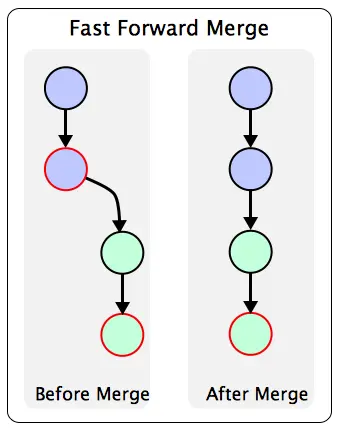

# Git & GitHub Session-2025

# Day 1

## **Introduction to Version Control Systems (VCS)**

A **Version Control System (VCS)** is a tool that helps track changes to files over time. It allows multiple people to collaborate on a project, maintain version history, and revert to previous states if needed. VCS is crucial for software development because:

- It enables collaboration among team members.
- Keeps a history of changes.
- Facilitates the rollback of mistakes.
- Tracks and manages code across branches.
- Other examples include Subversion(centralized VCS), Mercurial etc.

## **Why Git?**

Git is one of the most popular VCS, known for its **distributed** nature. Key advantages of Git include:

- **Speed**: Git is very fast compared to other VCS.
- **Distributed**: Every developer has a full copy of the repository, allowing for offline work.
- **Efficient Branching**: Git provides lightweight and flexible branching and merging strategies.

Linus story

NOTE- confirm everyone has installed git in system

## **Basic Git Commands**

**Creating a Repository**

```bash
git init
```

Initializes a new Git repository in the current directory.

**Checking Status**

```bash
git status
```

Displays the state of the working directory and the staging area.

**Adding Changes**

```bash
git add <file>
```

Stages file changes for the next commit.     (”git add .” to add all commands)

**Committing Changes**

```bash
git commit -m "message"
```

The below can be used too, but it will open a prompt and ask you to type the "message"

```bash
git commit
```

Commits staged changes with a descriptive message.

**Viewing History**

```bash
git log
```

Shows the commit history of the repository. (git log —oneline)

---

**Removing files**

```
   git rm file_name
```

Git untracks the file and also removes it from the git repository/directory.

## **What is the need of staging area(git add)?**
The staging area lets you choose exactly which changes are included in the next commit. It gives control to decide exactly what goes into that commit (checkpoint).

## **How to Write Good Commit Messages**

- **Subject Line**: Use a concise summary (max 50 characters) in the **imperative mood** (e.g., "Add new feature").
- **Body (optional)**: Include detailed explanation if needed:
    - Explain the "why" behind the change.
    - Describe the impact or reasoning.
- **Issue References**: Link to related issues using `Fixes #<issue-number>` or `Closes #<issue-number>` to automatically close them.
- **Formatting**:
    - Keep subject line under 50 characters.
    - Use present tense, imperative mood.

NOTE- Download git graph extension

## **Branches**

**Branches** allow developers to work on separate features without affecting the main codebase.

Listing Existing branches

List all branch

```bash
git branch
```

**Creating a Branch**

```bash
git branch <branch_name>
```

**Switching Branches**

```bash
git checkout <branch_name>
```

**Merging Branches**

```bash
git merge <branch_name>
```

Renaming Branch

```bash
git branch -m <old-branch-name> <new-branch-name>
```

Deleting Branch

```bash
git branch -d <branch-name>
```

# Day 2

## Merging

Merging is about bringing changes from one branch to another.

Fast forward and rebase  --> no merge commit

Three way merge --> merge commit will be created

### Fast Forward merge



This is the easiest merge.

Here main branch does not have any commits after the creation of feature branch therefore it can be directly merged.

There is no merge commit required.

There are no merge conflicts in this method

```bash
git checkout main
git merge bug-fix

```

This is a fast-forward merge. It means that the commits in the `bug-fix` branch are directly merged into the `main` branch. This can be useful when you want to merge a branch that has already been pushed to the remote repository.

bug-fix merged into the main branch

### 3-way Merge


There is a merge commit.

```bash
git checkout main
git merge bug-fix

```

There maybe merge conflicts

---

### Solving merge conflicts

```bash
git config --global core.editor "code --wait"

```

Note for organisers: Explain this with hands-on


Either solve merge conflicts directly through VSCODE or remove do it manually.

here *test* is the branch name

In the end remove these markers and redundant code.

```

<<<<<<< HEAD

=======

>>>>>>> test

```

## Rebase


Git rebase is a powerful Git feature used to change the base of a branch. It effectively allows you to move a branch to a new starting point, usually a different commit, by “replaying” the commits from the original base onto the new base. This can be useful for keeping a cleaner, linear project history.

Some people like to use rebase over the merge command because it allows you to keep the commit history cleaner and easier to understand. It also allows you to make changes to the code without affecting the original branch.

```bash
git checkout feature-branch
git rebase main

```

These commands set the head of the feature branch to main branch's latest commit.

### Resolving conflicts in rebase

If there are any conflicts, you will need to resolve them manually or use VS Code to do it for you.

**Step-1: Fixing conflicts**

Solve conflicts just like you had solved merge conflicts previously

Remove the `<<<<<<<`, `=======`, and `>>>>>>>` markers.

**Step 2: Stage the resolved files**

```bash
git add file.txt

```

**Step 3: Continue the rebase**

```bash
git rebase --continue

```

**Step 4: Repeat if there are more conflicts**

**Step 5: Abort rebase if needed**

```bash
git rebase --abort

```

This restores your branch to the state before starting the rebase.

# Day 3

## [**Generating a new SSH key**](https://docs.github.com/en/authentication/connecting-to-github-with-ssh/generating-a-new-ssh-key-and-adding-it-to-the-ssh-agent#generating-a-new-ssh-key)

**SSH key** is used to securely connect your local machine (or server) to GitHub **without needing to enter your username and password every time** you interact with repositories (for example, when you run `git push`, `git pull`, or `git clone`).

You can generate a new SSH key on your local machine. After you generate the key, you can add the public key to your account on GitHub.com to enable authentication for Git operations over SSH.

1. Open Git Bash.
2. Paste the text below, replacing the email used in the example with your GitHub email address. And generate the key
    
    ```bash
    ssh-keygen -t ed25519 -C "your_email@example.com"
    ```
    
3. Copy the key to the clipboard

`clip < ~/.ssh/id_ed25519.pub` - windows
`pbcopy < ~/.ssh/id_ed25519.pub`  - mac
4. Add the key to the github. (settings/access/ssh ang gpg key)

## What is .gitignore?

A `.gitignore` file is a plain text file used in Git to specify which files or directories should be ignored by version control. This means Git will not track changes to these files or include them in commits.

It’s commonly used to exclude files that are unnecessary or sensitive, such as:

- **Temporary or system files** (e.g., `.DS_Store`, `thumbs.db`)
- **Build artifacts or dependencies** (e.g., `node_modules/`, `dist/`)
- **Configuration or environment files** containing sensitive data (e.g., `.env`)

By using a `.gitignore` file, you keep your repository clean, secure, and free from files that don’t belong in version control.


### Cloning a repo

We can clone a repository that brings a remote repository available on GitHub to our local folder/directory.

```bash
git clone <https://github.com/octocat/Hello-World>

```

### Remote URL Setting

You can check the remote url setting by running the following command:

Terminal window

```bash
git remote -v

```

This will show you the remote url of your repository.

**origin and upstream can be same or different depending whether you forked a repository or not**

```bash

origin   <https://github.com/kaustubh/express.git> (fetch)
origin   <https://github.com/kaustubh/express.git> (push)
upstream <https://github.com/expressjs/express.git> (fetch)
upstream <https://github.com/expressjs/express.git> (push)

```

> You can push to upstream if you are part of the expressJS organisation and have write access
> 

### Origin, Upstream and Push

Origin: Your own copy(in your own repository)

Upstream: the original project where you forked from

You can add a remote repository by running the following command:

> git remote add origin <remote-url>
> 

Here `<remote-url>` is the url of the remote repository that you want to add and origin is the name of the remote repository. This origin is used to refer to the remote repository in the future.

Instead of origin we can use any keyword, origin is just the standard convention.

```bash
git remote add origin <https://github.com/><your_username>/HelloWorld.git

```

Setting up an upstream remote is useful when you want to keep your local repository up to date with the remote repository. It allows you to fetch and merge changes from the remote repository into your local repository.

In case you have forked a repository 👇

```bash
git remote add upstream <remote-url>

```

This will set up an upstream remote and push your code to the remote repository.

```bash
git push -u origin main

```

Without `-u`:

```bash
git push origin main   # have to type origin main every time
git pull origin main

```

With -u (once):

```bash
git push -u origin main   # sets upstrea

```

### Get code from remote repository

There are two ways to get code from a remote repository:

- fetch the code
- Pull the code

Fetching the code means that you are going to download the code from the remote repository to your local repository

```bash
git fetch <remote-name>

```

Pull the code means that you are going to download the code from the remote repository and merge it with your local repository.

```bash
# git pull <remote-name> <branch-name>
git pull origin main

```

## Github Student Developer pack

[https://education.github.com/pack](https://education.github.com/pack)
